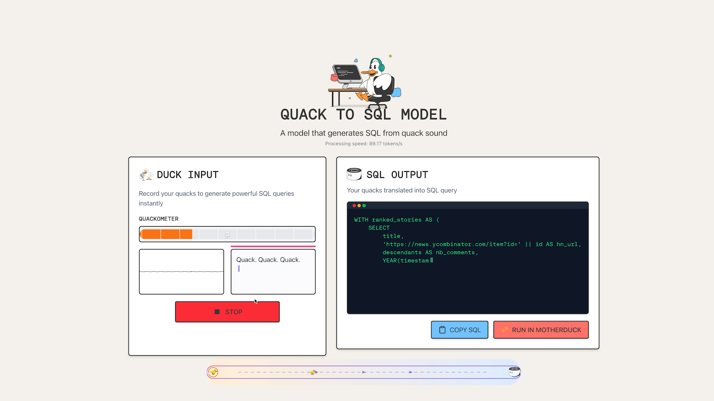

# Quack-to-SQL

Transform your duck sounds into SQL queries with the world's first quack-powered query generator! Quack-to-SQL is a revolutionary web application that converts your duck impressions into powerful SQL queries, all processed right in your browser with complete privacy.

Experience it live at [www.motherduck.com/quacktosql](www.motherduck.com/quacktosql)

Built with [transformer.js](https://www.npmjs.com/package/@huggingface/transformers) and whisper model

Tech Stack:
- Next.js & React
- Tailwind CSS
- Web Audio API
- WebAssembly for local audio processing
- Transformers.js for in-browser ML model execution

## Features

- Capture duck sounds through your microphone with an intuitive interface
- Real-time audio visualization and transcription
- Complete privacy - all processing happens locally on your device
- Seamless conversion of quack sounds into SQL queries
- Modern, responsive UI with a delightful user experience
- Track your progress with the Quackometer - your personal quacking proficiency meter

## License

MIT

